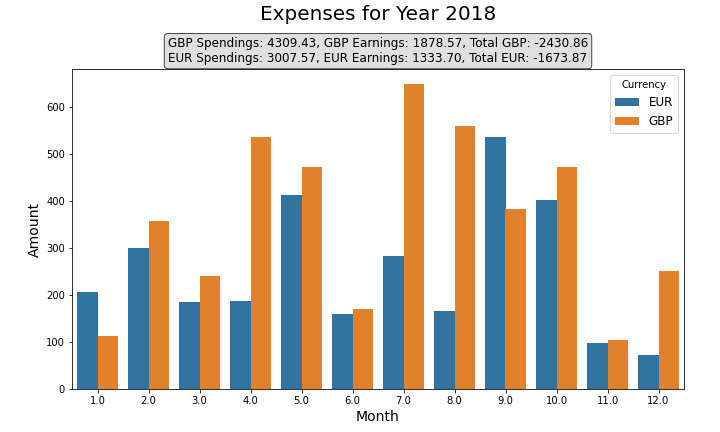
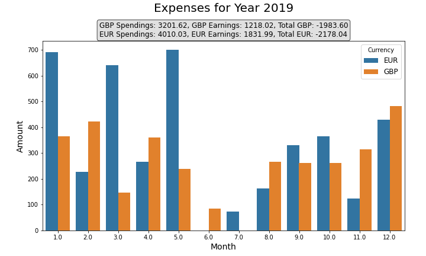
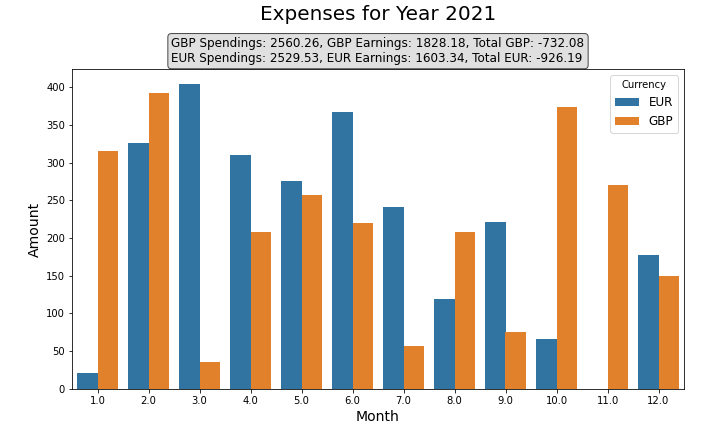
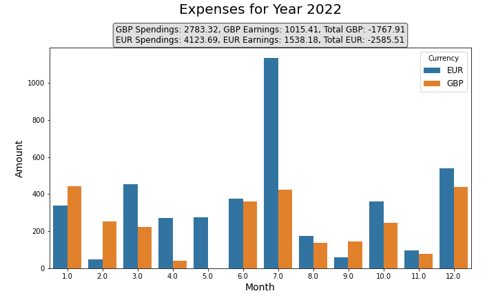
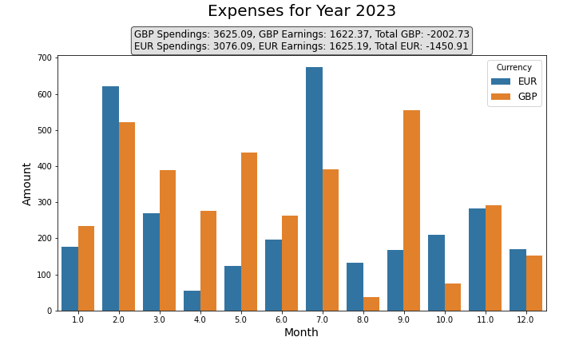

# Expense Tracker Project

The Expense Tracker project is designed to help users track their expenses and earnings over time. It uses SQLite for data storage, Pandas for data manipulation, and Python's data visualization libraries for generating insightful plots.

## File Overview
1. **`import_and_clean_data.py`**: This script imports CSV data into SQLite database tables for Revolut and Starling accounts. It also performs data cleaning operations on the imported data. You can skip this step/prepare your data on your own.

2. **`analysis_and_visualization.py`**: This script loads the cleaned data from the SQLite database, performs analysis, and generates visualizations using Matplotlib and Seaborn.

## Test Run
Running the file **`test_visualization.py`** we create fake data and then use it for our visualization.

For each year we display the following:
- monthly spending in EUR
- monthly spending in GBP
- the total amount earned/spent that year in GBP and EUR

## Example of the end result

